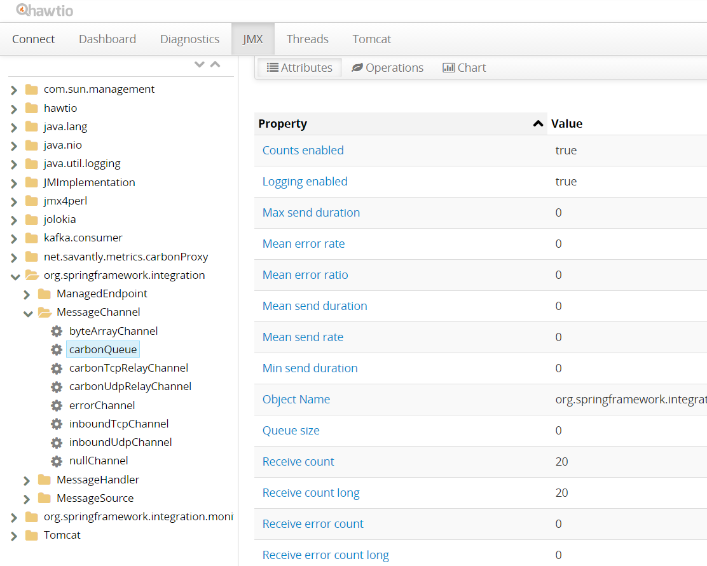

# carbon-proxy

A proxy/relay for the Carbon daemon.

Use this to relay metrics to other systems like Kafka.  
This server includes a full suite of JMX monitoring, including messaging channels and endpoints.   
JMX GUI provided by Hawtio + Jolokia.  

Hawtio -

  
  
  
Settings -  

```
# Web Management GUI
server.port=8800

# The local port and ip for the proxy to listen on
carbonProxy.server-port=2013
carbonProxy.server-address=0.0.0.0

# Where we relay the messages to
carbonProxy.carbon-port=2003
carbonProxy.carbon-host=localhost

# Kafka Configuration
spring.kafka.consumer.group-id=foo
spring.kafka.consumer.auto-offset-reset=earliest

# Logging levels
logging.level.org.springframework.integration=INFO
logging.level.net.savantly=DEBUG

# JMX
endpoints.jmx.domain=net.savantly.metrics.carbonProxy
endpoints.jmx.unique-names=true

# Hawtio
hawtio.authentication-enabled=false

# Security
#security.user.name=admin
#security.user.password=secret

# App management
management.security.enabled=false
# If you want the management interface on a different port #management.port=8081
# management.security.roles=SUPERUSER
# From localhost only #management.address=127.0.0.1
```